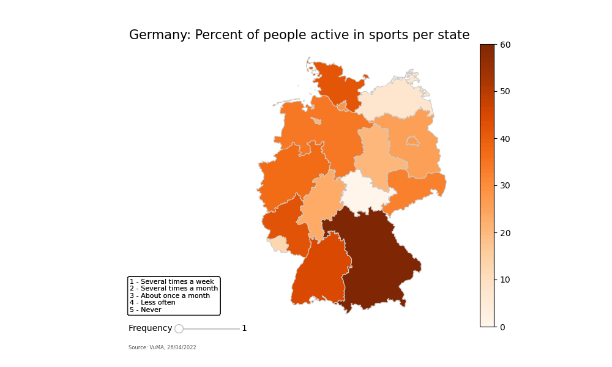

# Applied Data Science Assignment
## Author
- [@novotz](https://github.com/novotz)

## Table of contents
- [Project description](#1)
- [Data source](#2)
- [Quick glance at the results](#3)
- [Explore the notebook](#4)
- [Repository structure](#5)

<a id='1'></a>
## Project description
To obtain the specialization [Applied Data Science with Python](https://www.coursera.org/specializations/data-science-python), one task was to 
find at least two data sets on the internet and visualise them to answer a 
question about sports or athletics (see below) for the region of Osnabrück, 
Lower Saxony, Germany or Germany in general.

When I was thinking about an assignment that was supposed to deal with the topic 
of sports in Germany, I looked at what the German statistical office (DESTATIS) 
had available. However, I did not find anything there. Nevertheless, I found out 
that VuMA had conducted a market media study in which German citizens were also 
asked about their sports behavior. So it was just right for my project.

It was important to me that the data was publicly accessible and could be 
downloaded in a suitable file format. I also wanted to divide the data into 
different regions of Germany, so that a demarcation between different parts 
of Germany could take place. Here I had first thought of counties, but that 
would quickly become very confusing with currently 294 counties and 107 
independent cities. Therefore, I decided to use the next higher level, the 
federal states. After all, there are only 16 of these in Germany.

The question I want to answer with my visualisation is this: **Are there any 
particularly sporty federal states in Germany?**

<a id='2'></a>
## Data source
- [VUMA-Touchpoints](https://touchpoints.vuma.de/)
- [Cartography and geodesy](https://gdz.bkg.bund.de/index.php/default/verwaltungsgebiete-1-2-500-000-stand-01-01-vg2500.html)

<a id='3'></a>
## Quick glance at the results


<a id='4'></a>
## Explore the notebook
Click [here](notebook/final_assignment.ipynb) to explore the notebook.

<a id='5'></a>
## Repository structure
```
📦applied_data_science_assignment
 ┣ 📂attachments
 ┃ ┗ 📜University_of_Michigan_logo.png
 ┣ 📂build_gif
 ┃ ┣ 📜1.png
 ┃ ┣ 📜2.png
 ┃ ┣ 📜3.png
 ┃ ┣ 📜4.png
 ┃ ┣ 📜5.png
 ┃ ┣ 📜animated_plot.gif
 ┃ ┣ 📜build_gif.py
 ┃ ┗ 📜requirements.txt
 ┣ 📂data
 ┃ ┣ 📜aktualitaet.txt
 ┃ ┣ 📜vg2500_bld.dbf
 ┃ ┣ 📜vg2500_bld.prj
 ┃ ┣ 📜vg2500_bld.shp
 ┃ ┣ 📜vg2500_bld.shx
 ┃ ┣ 📜vg2500_geo84.zip
 ┃ ┣ 📜vg2500_krs.dbf
 ┃ ┣ 📜vg2500_krs.prj
 ┃ ┣ 📜vg2500_krs.shp
 ┃ ┣ 📜vg2500_krs.shx
 ┃ ┣ 📜vg2500_rbz.dbf
 ┃ ┣ 📜vg2500_rbz.prj
 ┃ ┣ 📜vg2500_rbz.shp
 ┃ ┣ 📜vg2500_rbz.shx
 ┃ ┣ 📜vg2500_sta.dbf
 ┃ ┣ 📜vg2500_sta.prj
 ┃ ┣ 📜vg2500_sta.shp
 ┃ ┣ 📜vg2500_sta.shx
 ┃ ┣ 📜VuMA--2022-04-26.xlsx
 ┃ ┗ 📜VuMA_Berichtsband_2022.pdf
 ┣ 📂notebook
 ┃ ┣ 📜final_assignment.ipynb
 ┃ ┗ 📜requirements.txt
 ┗ 📜README.md
```
